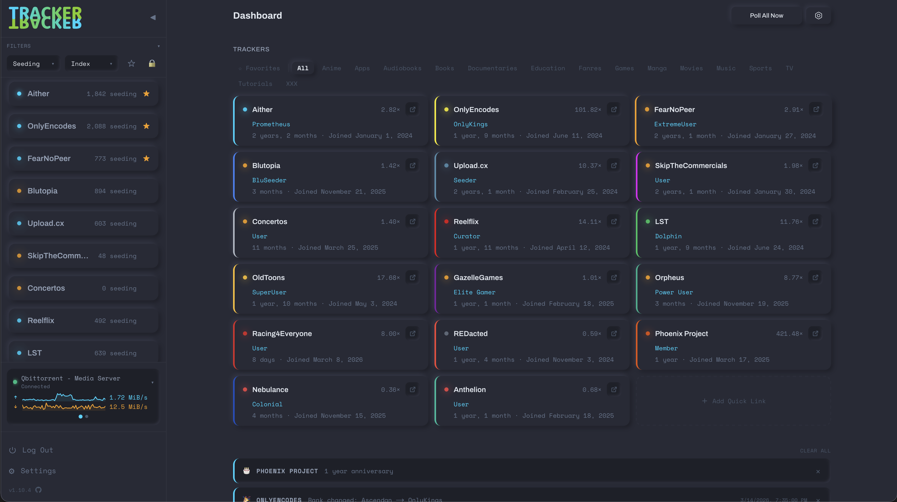
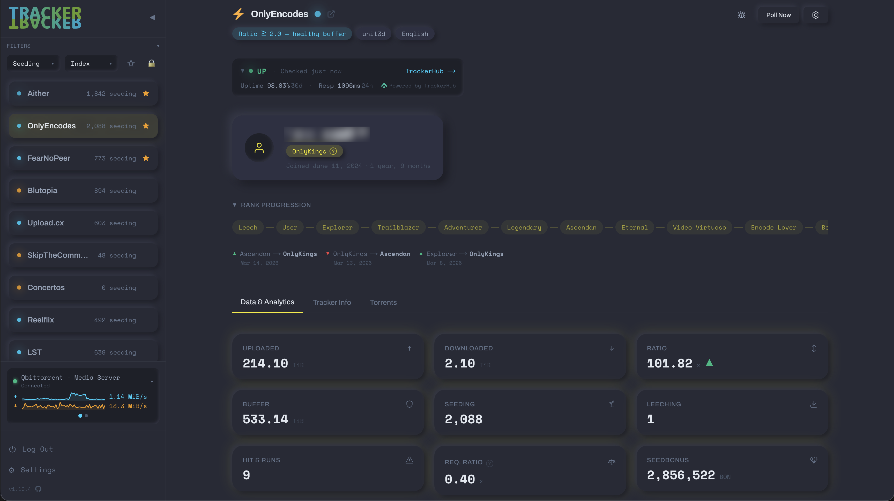

[](https://jordanlambrecht.github.io/tracker-tracker/)

<p align="center">
  
</p>

Self-hosted dashboard for monitoring private tracker stats over time. Track upload, download, ratio, buffer, seedbonus, and rank across all your trackers from one place.

## Features

- Per-tracker and fleet-wide stats with 30+ charts
- UNIT3D, Gazelle, GGn, Nebulance, MAM, and AvistaZ network support out of the box
- qBittorrent integration - cross-seed tracking, activity heatmaps, speed history, etc
- Everything stays on your machine. No telemetry, no phoning home.

## Screenshots

<p align="center">
  
</p>

<p align="center">
  
</p>

You can check out a few other, longer, screenshots in the docs folder.

## Supported Trackers

| Tracker               | Platform  | Status                 | Note                                              |
| --------------------- | --------- | ---------------------- | ------------------------------------------------- |
| Aither                | UNIT3D    | ✅ Verified            |                                                   |
| Anthelion             | Nebulance | ✅ Verified            |                                                   |
| Blutopia              | UNIT3D    | ✅ Verified            |                                                   |
| Concertos             | UNIT3D    | ✅ Verified            |                                                   |
| FearNoPeer            | UNIT3D    | ✅ Verified            |                                                   |
| GazelleGames (GGn)    | GGn       | ✅ Verified            |                                                   |
| LST                   | UNIT3D    | ✅ Verified            |                                                   |
| Nebulance             | Nebulance | ✅ Verified            |                                                   |
| OldToons              | UNIT3D    | ✅ Verified            |                                                   |
| OnlyEncodes           | UNIT3D    | ✅ Verified            |                                                   |
| Orpheus (OPS)         | Gazelle   | ✅ Verified            |                                                   |
| Phoenix Project (PP)  | Gazelle   | ✅ Verified            |                                                   |
| Racing4Everyone       | UNIT3D    | ✅ Verified            |                                                   |
| Redacted (RED)        | Gazelle   | ✅ Verified            |                                                   |
| ReelFlix              | UNIT3D    | ✅ Verified            |                                                   |
| SkipTheCommercials    | UNIT3D    | ✅ Verified            |                                                   |
| Seedpool              | UNIT3D    | ✅ Verified            |                                                   |
| Upload.cx             | UNIT3D    | ✅ Verified            |                                                   |
| Yu-Scene              | UNIT3D    | ✅ Verified            |                                                   |
| Zenith                | UNIT3D    | 🟡 Unverified          |                                                   |
| IPTorrents            | IPTorrents| 🟡 Unverified          | Session-cookie scraper, no public API              |
| TorrentLeech          | TorrentLeech | 🟡 Unverified       | Username/password login, no public API             |
| Portugas              | UNIT3D    | 📋 Draft               | API endpoint unavailable on this custom build     |
| AlphaRatio            | Gazelle   | 🟡 Unverified ⛔ Stuck |                                                   |
| AnimeBytes            | Gazelle   | 🟡 Unverified ⛔ Stuck |                                                   |
| BroadcastheNet (BTN)  | BTN       | 🟡 Unverified          | JSON-RPC adapter; needs an account holder to verify |
| Empornium             | Gazelle   | 🟡 Unverified ⛔ Stuck | XXX trackers aren't really my jam, so PRs welcome |
| GreatPosterWall (GPW) | Gazelle   | 🟡 Unverified          |                                                   |
| MoreThanTV (MTV)      | Gazelle   | 🟡 Unverified          |                                                   |
| PassThePopcorn (PTP)  | Gazelle   | 🟡 Unverified          |                                                   |
| 720pier               | Custom    | 📋 Needs adapter       |                                                   |
| ABTorrents            | Custom    | 📋 Needs adapter       |                                                   |
| AvistaZ               | AvistaZ   | ✅ Verified            | Cookie auth + HTML scraping                       |
| AnimeZ                | AvistaZ   | 🟡 Unverified          | Same adapter as AvistaZ                           |
| CinemaZ               | AvistaZ   | ✅ Verified            | Same adapter as AvistaZ                           |
| ExoticaZ              | AvistaZ   | 🟡 Unverified          | Same adapter as AvistaZ                           |
| PrivateHD             | AvistaZ   | 🟡 Unverified          | Same adapter as AvistaZ                           |
| MyAnonamouse (MAM)    | MAM       | ✅ Verified            | Cookie auth via mam_id                            |
| DarkPeers             | UNIT3D    | ✅ Verified            |                                                   |
| Luminarr              | UNIT3D    | 🟡 Unverified          |                                                   |
| CathodeRayTube (CRT)  | UNIT3D    | 📋 Draft               |                                                   |
| DigitalCore           | Custom    | ✅ Verified            |                                                   |
| HDBits                | Custom    | 📋 Needs adapter       |                                                   |
| SecretCinema          | Custom    | 📋 Needs adapter       |                                                   |
| SportsCult            | Custom    | 📋 Needs adapter       |                                                   |
| BeyondHD              | Custom    | ⛔ Stuck               |                                                   |
| Cinemageddon          | Custom    | ⛔ Stuck               |                                                   |
| FileList              | Custom    | ⛔ Stuck               |                                                   |
| HD-Torrents           | Custom    | ⛔ Stuck               |                                                   |
| TVVault               | Custom    | ⛔ Stuck               |                                                   |
| HawkeUno              | Hawke     | ✅ Verified            |                                                   |

**Legend:**

- ✅ **Verified** — tested against a live tracker
- 🟡 **Unverified** — platform adapter exists and _should_ work, but not yet tested.
- 📋 **Needs adapter** — registry entry exists, but the platform requires a custom adapter that I haven't gotten around to yet
- ⛔ **Stuck** — trackers I'm not a member of and have no way of implementing
- ❌ **Broken** — known issue prevents polling (i.e API blocks required endpoints, etc)

## Download Clients

| Client       | Status       | Notes                                                                |
| ------------ | ------------ | -------------------------------------------------------------------- |
| qBittorrent  | ✅ Supported | Torrent stats, cross-seed tracking, activity heatmaps, speed history |
| Deluge       | 📋 Planned   |                                                                      |
| Transmission | 📋 Planned   |                                                                      |
| rTorrent     | 📋 Planned   |                                                                      |

## Quick Start

### Docker (recommended)

```bash
mkdir tracker-tracker && cd tracker-tracker
```

1. Download the compose file and example env:

   ```bash
   curl -LO https://raw.githubusercontent.com/jordanlambrecht/tracker-tracker/main/docker-compose.yml
   curl -L https://raw.githubusercontent.com/jordanlambrecht/tracker-tracker/main/.env.example -o .env
   ```

2. Generate secrets and paste them into `.env`:

   ```bash
   # Run these, then copy the output into .env
   openssl rand -base64 24   # → POSTGRES_PASSWORD
   openssl rand -base64 48   # → SESSION_SECRET
   ```

3. Start the stack:

   ```bash
   docker compose up -d
   ```

4. Visit `http://localhost:3000` to set your master password and start adding trackers.

### Updating

```bash
docker compose pull && docker compose up -d
```

The database schema is synced automatically on startup.

### Using an external database

If you already run Postgres, remove the `tracker-tracker-db` service and `depends_on` block from `docker-compose.yml`. Set `DATABASE_URL` in your `.env` and remove `POSTGRES_PASSWORD` and `POSTGRES_USER`.

### Local Development

Requires Node.js 24+, pnpm, and PostgreSQL.

```bash
pnpm install
cp .env.example .env.local
# Edit .env.local — set DATABASE_URL to your local Postgres and SESSION_SECRET
pnpm db:push
pnpm dev
```

## Configuration

| Variable            | Required | Default           | Description                                         |
| ------------------- | -------- | ----------------- | --------------------------------------------------- |
| `POSTGRES_PASSWORD` | Yes\*    | —                 | Database password                                   |
| `SESSION_SECRET`    | Yes      | —                 | Signs session cookies **and** wraps your encryption key (min 32 characters). Never rotate it after setup — see [Locked Out?](#locked-out-recovering-a-lost-master-password) |
| `TZ`                | No       | `UTC`             | Timezone for cron schedules and log timestamps      |
| `PORT`              | No       | `3000`            | Port the app listens on                             |
| `LOG_LEVEL`         | No       | `info`            | Log verbosity: `error`, `warn`, `info`, `debug`     |
| `POSTGRES_USER`     | No       | `postgres`        | Database user                                       |
| `POSTGRES_DB`       | No       | `tracker_tracker` | Database name                                       |
| `DATABASE_URL`      | No\*     | _(auto-built)_    | Override to use an external Postgres instance       |
| `SECURE_COOKIES`    | No       | _(auto)_          | Set `true` for HTTPS. Auto-enabled by `BASE_URL`.   |
| `DISABLE_LOGIN_LOCKOUT` | No   | _(unset)_         | Set `true` to stop failed-attempt lockouts being enforced, for when you have locked yourself out — the in-app toggle sits behind the login you cannot reach. Also suppresses enforcement on the backup-restore password check. Failed attempts are still counted, and a successful login clears them. Unset it once you are back in. |

\* Set either `POSTGRES_PASSWORD` (bundled DB) or `DATABASE_URL` (external DB).

All other settings — polling interval, privacy mode, proxy, backups — are configured in the app's Settings page after login.

## Data & Volumes

| Host path        | Container path  | Contents                                |
| ---------------- | --------------- | --------------------------------------- |
| `./data/backups` | `/data/backups` | Scheduled backup files                  |
| `./data/logs`    | `/data/logs`    | Application log files                   |
| `pgdata` (named) | PG data dir     | PostgreSQL database (managed by Docker) |

## Locked Out? Recovering a Lost Master Password

There is no "forgot password" email — this is a single-user app with no mail server. Instead, the app container ships a recovery command:

```bash
docker exec -it tracker-tracker-app tt-recover --check    # can I recover? writes nothing
docker exec -it tracker-tracker-app tt-recover            # dry run, prompts for the new password
docker exec -it tracker-tracker-app tt-recover --apply    # commit
```

**Take a database dump first.** It costs seconds and it is the one step you cannot add later:

```bash
docker exec tracker-tracker-db sh -c \
  'pg_dump -U "$POSTGRES_USER" tracker_tracker' > tracker-tracker-backup.sql
```

**Do not edit `password_hash` by hand.** Every secret in the database — tracker API tokens, download client credentials, notification configs, your TOTP secret — is encrypted with a key derived from your master password. `UPDATE app_settings SET password_hash = ...` lets you log in with a key that decrypts nothing, and orphans all of it permanently with no error message. `tt-recover` recovers the real encryption key, re-encrypts every secret under the new password, clears the lockout counter, and rewrites the hash in a single transaction.

Two things it needs, and one thing it refuses:

- `SESSION_SECRET` must be byte-identical to what the instance has been running with. It is the only thing that can unwrap the stored encryption key.
- `-it` on `docker exec`, so the password can be typed at a hidden prompt instead of landing in your shell history. (`--password '<pw>'` exists for scripting, but it is visible in `ps`.)
- If `app_settings.encrypted_scheduler_key` is NULL — cleared by an emergency lockdown, a nuke, or a failed restore — recovery is impossible and the tool aborts rather than orphaning your data. Restore a dump from before that point.

Lost your authenticator too? Add `--disable-totp` to clear 2FA in the same transaction.

Full walkthrough, including running against an external database: **[Lost Master Password](https://jordanlambrecht.github.io/tracker-tracker/reference/password-recovery/)**.

## Adding a Tracker

1. Click **+ Add Tracker** in the sidebar
2. Select from the registry or enter details manually
3. Paste your API token (found in your tracker's security/API settings)
4. The app validates the connection and starts polling automatically

## Documentation

Full documentation is available at **[jordanlambrecht.github.io/tracker-tracker](https://jordanlambrecht.github.io/tracker-tracker/)**.

Covers installation, tracker setup (UNIT3D, Gazelle, GGn, MAM, AvistaZ), features (proxies, TOTP, backups, download clients, notifications), and troubleshooting.

## Contributing

PRs welcome. Areas where help matters most:

- **New trackers & missing data** — copy [`src/data/trackers/_template.ts`](src/data/trackers/_template.ts), fill in what you know, and submit a PR. Partial entries are fine — set `draft: true` and CI will accept it. Filling in user classes, rules, release groups, and banned groups on existing trackers is just as valuable.
- **Download client adapters** — only qBittorrent is supported. Deluge, Transmission, and rTorrent all need adapters. See `src/lib/qbt/` for the pattern.
- **Tracker verification** — if you belong to a tracker marked 🟡 above, testing and confirming it works helps greatly.
- **Security auditing** — Check out SECURITY.md for threat surfice info.
- **Responsiveness** - I only have my 16" MBP to work off of, so feedback of different screen experiences is much appreciated
- **Data Visualization** - I ain't no math wizard, so any contributions for data viz, charts/graphs, etc.
- **Custom platform adapters** — trackers marked "Custom" need bespoke adapters since they don't run a supported platform.

Tracker Tracker is free and independently maintained. [GitHub Sponsors](https://github.com/sponsors/jordanlambrecht) for recurring support, [Buy Me a Coffee](https://buymeacoffee.com/jordyjordy) for a one-off.

## Architecture

- **Next.js 16** (App Router)
- **PostgreSQL** + **Drizzle ORM**
- **ECharts**
- **node-cron**
- **Argon2**
- **jose**

## License

[GPL-3.0](LICENSE)
