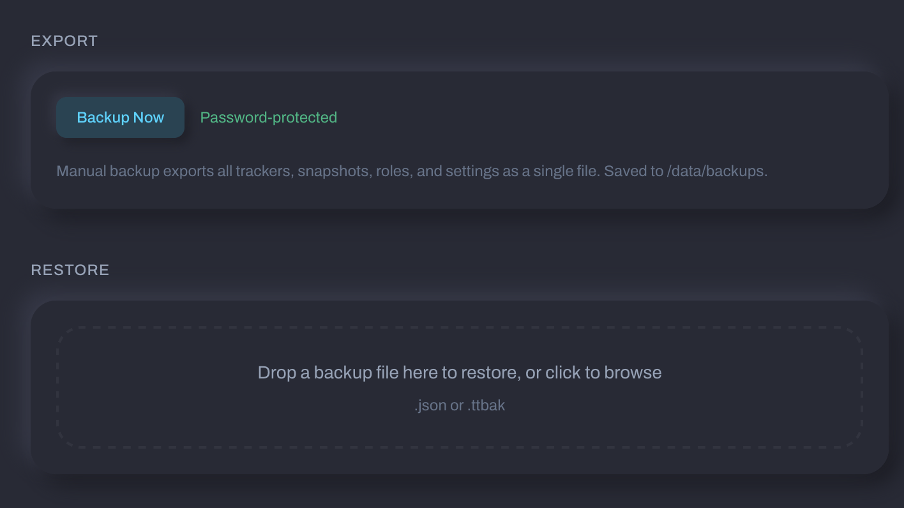
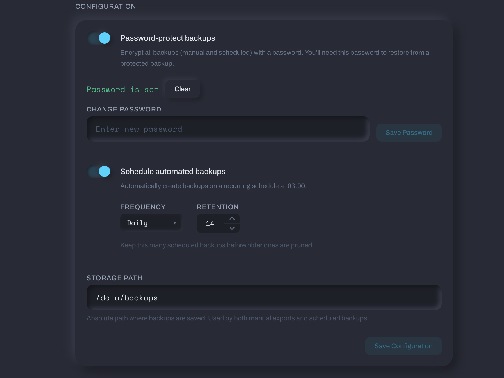

# Backups

Tracker Tracker can back up your configuration and history. You can download a backup manually at any time, or set up automatic scheduled backups saved to disk on the server.

## What Gets Backed Up

A backup captures a snapshot of everything you'd need to fully restore the app:

- App settings (poll intervals, proxy settings, notification settings, TOTP state)
- All trackers and their configurations
- Full upload/download history (snapshots)
- Tracker membership roles
- Download client configurations
- Tag groups
- Download client speed history
- Notification targets

Sensitive values — API tokens, download client credentials, proxy passwords, webhook URLs, TOTP secrets — are included in the backup in encrypted form. They stay encrypted the whole time they're in the file.

### What is NOT in backups

- **Your password.** It's never exported. A backup file cannot be used to recover your login password.
- Failed login attempt counters (these reset to zero on restore).
- Transient runtime state: last poll time, last error, cached torrent lists.
- Notification delivery history.

## Backup File Format

Backups are plain JSON files. Encrypted backups use the `.ttbak` extension.

The file includes a header with the version, creation time, your instance URL, and counts of each data type — useful for confirming you're restoring the right file before proceeding.

## Encrypted Backups (.ttbak)

You can wrap a backup in an extra layer of encryption. This produces a `.ttbak` file that requires a password to restore.

The encryption password for backups is separate from your login password. Set it in **Settings → Backups**. Each backup generates its own random key — two backups with the same password produce different ciphertext.

Encrypted backups are useful if you store them in cloud storage, send them offsite, or anywhere you'd rather not have the raw config readable.

## Exporting a Backup Manually

Go to **Settings → Backups** and click **Export Now**. The file downloads directly to your browser. Manual exports are not saved on the server and won't appear in backup history.

## Scheduled Backups

Scheduled backups run automatically at **03:00 server time**.

| Frequency | When it runs                     |
| --------- | -------------------------------- |
| Daily     | Every day at 03:00               |
| Weekly    | Every Monday at 03:00            |
| Monthly   | First day of each month at 03:00 |

Scheduled backups are saved to the storage path you set in **Settings → Backups** and are listed in the backup history.

### Retention

Set a retention count (1-365, default 14). When a new scheduled backup is created and the total exceeds that number, the oldest backup files are deleted automatically.

## Restoring a Backup

### Before you start

- You'll need your **current login password** to confirm the restore.
- If the backup is a `.ttbak` encrypted file, you'll also need the backup's encryption password.

### What happens during a restore

1. The backup file is validated.
2. All existing data is deleted.
3. Backup data is written to the database.
4. If the backup came from a different instance (different encryption setup), all encrypted fields are automatically re-encrypted to work with your current password.
5. Failed login attempts are reset to zero.
6. **Your current login password is not changed.** You don't need to log out or log back in.

### Cross-instance restores

If you're restoring a backup from a different Tracker Tracker installation — one that was set up with a different password — Tracker Tracker will re-encrypt the sensitive fields automatically so they work with your current password.

If a field can't be re-encrypted (for example, because the backup was encrypted with a password you no longer know), that field is cleared rather than saved in a broken state. For TOTP, the restore screen will tell you if 2FA was turned off as a result. You can re-enable it after the restore completes.

!!! warning "TOTP after a cross-instance restore"
If 2FA was active on the source instance but can't be carried over, it will be disabled. Re-enroll in **Settings → Security** after the restore.

## Settings Reference

| Setting           | Default | Description                                                       |
| ----------------- | ------- | ----------------------------------------------------------------- |
| Scheduled backups | Off     | Enable automatic backups on a schedule                            |
| Frequency         | Daily   | How often scheduled backups run: daily, weekly, or monthly        |
| Retention count   | 14      | How many scheduled backups to keep (1-365)                        |
| Encrypt backups   | Off     | Wrap scheduled backups in an additional encryption layer (.ttbak) |
| Storage path      | —       | Directory on the server where scheduled backup files are saved    |
