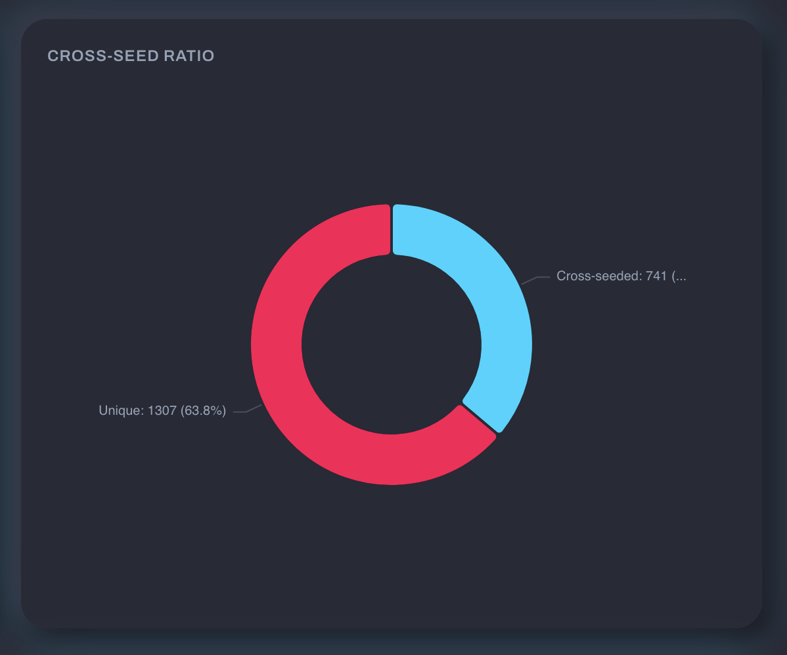

# Download Clients

Tracker Tracker connects to qBittorrent's web interface to pull live torrent data. This powers the Torrents tab with active downloads and uploads, speeds, seeding counts, ratio histograms, and cross-seed stats.

## Supported Clients

| Client       | Status      |
| ------------ | ----------- |
| qBittorrent  | Supported   |
| Deluge       | Coming soon |
| Transmission | Coming soon |
| rTorrent     | Coming soon |

## Adding a Client

Go to **Settings → Download Clients** and fill in your connection details:

| Field    | Notes                                                       |
| -------- | ----------------------------------------------------------- |
| Name     | A label for this client                                     |
| Host     | Hostname or IP — do **not** include `http://` or `https://` |
| Port     | Default qBittorrent Web UI port is `8080`                   |
| Username | qBittorrent Web UI username                                 |
| Password | qBittorrent Web UI password                                 |
| Use SSL  | Enable if your qBittorrent Web UI is served over HTTPS      |

!!! warning "SSL/port mismatch"
    The form will warn you if SSL is on with port 80, or SSL is off with port 443. These combinations are usually misconfigured. You can still save, but double-check your settings.

After saving, use the **Test Connection** button to confirm Tracker Tracker can reach and authenticate with qBittorrent.

## Linking Trackers to a Client

Assign each tracker a **qBittorrent tag** that matches the label you use for that tracker's torrents. When polling, Tracker Tracker fetches only torrents with the matching tag for per-tracker stats. Open the tracker's settings and fill in the qBittorrent tag field.

## How Polling Works

Tracker Tracker runs two polling loops:

=== "Live speed (every 30 seconds)"

    Lightweight request for current upload/download speeds. Displayed in the sidebar and uptime tracker.

=== "Full torrent data (every 5 minutes)"

    Fetches the full torrent list per tag and aggregates stats: seeding count, leeching count, speeds. Cached as snapshots so the Torrents tab works even if qBittorrent is briefly offline.

Both loops reuse the same session. qBittorrent only re-authenticates on 403 responses.

## Cross-Seed Detection

Use [cross-seed](https://cross-seed.org/) to find matching torrents across trackers? Configure cross-seed tags on the download client. Any torrent with one of those tags is counted separately in the cross-seed stats — so you can see how many torrents are cross-seeded vs. original grabs.

Set cross-seed tags in the client settings after adding it. Common tags are `cross-seed` (the default) or category-based like `cs-link-movies`, `cs-link-tv`.

For more on setting up cross-seed itself, see the [cross-seed documentation](https://cross-seed.org/docs/basics/getting-started).

## Privacy: What Gets Stripped

Tracker Tracker removes these fields from torrent data before caching or displaying:

- Announce URLs (which contain your tracker passkey)
- File paths on disk

This applies everywhere: dashboard, cached lists, API responses.

## Credential Security

Your qBittorrent username and password are encrypted at rest. They're decrypted in memory only when polling starts, used for authentication, and never logged.

## Troubleshooting

| Error                                                      | Meaning                                                                                           |
| ---------------------------------------------------------- | ------------------------------------------------------------------------------------------------- |
| `ECONNREFUSED`                                             | qBittorrent is not running, or the port is wrong                                                  |
| `ENOTFOUND`                                                | The hostname couldn't be resolved — check for typos                                               |
| `ETIMEDOUT` / timed out after 15s                          | qBittorrent didn't respond in time — check that it's reachable from the Docker container          |
| `Authentication failed — check username and password`      | Wrong credentials                                                                                 |
| `Authentication failed — SID cookie not found in response` | Unexpected response from qBittorrent — check that the Web UI is enabled in qBittorrent's settings |

The Test Connection button forces a fresh login, so errors reflect the current state.
