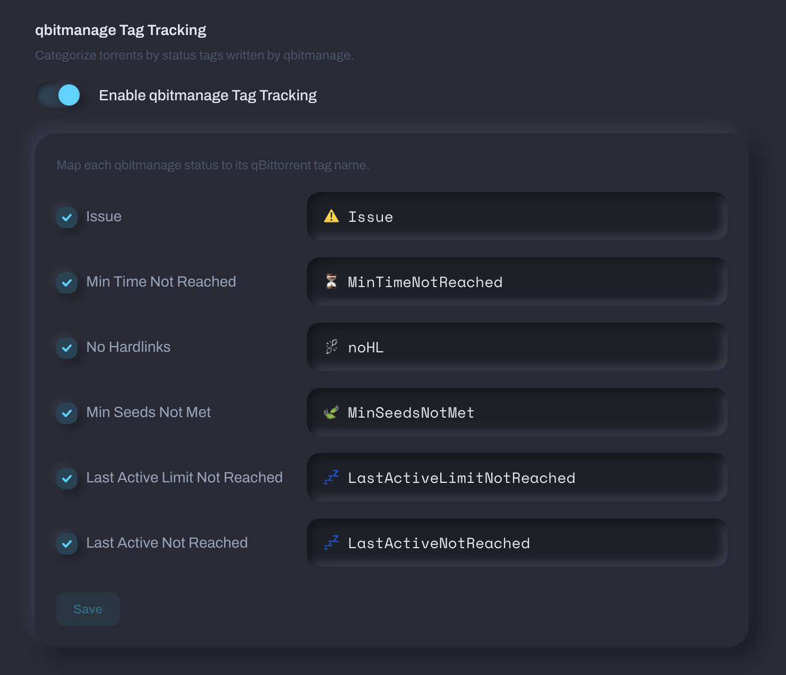
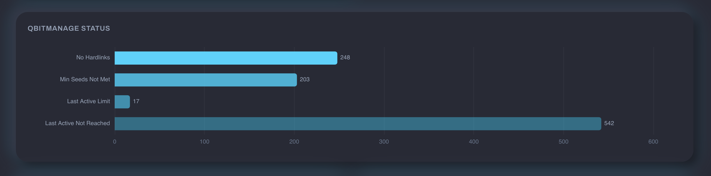

# qbitmanage Integration

[qbitmanage](https://github.com/StuffAnThings/qbit_manage) automatically manages qBittorrent torrents — tags, categories, cleanup, share limits, and more. If you're already running it, Tracker Tracker can read those tags and build charts from them.

For general tag group setup, see [Tag Groups](tag-groups.md).

## How It Works

qbitmanage writes tags to qBittorrent. Tracker Tracker reads them during its deep poll cycle. Create tag groups matching qbitmanage's tag names and charts appear automatically on each tracker's Torrents tab. Both tools talk to qBittorrent independently.

## Built-In Status Tag Tracking

Tracker Tracker has built-in support for qbitmanage's status tags. Turn it on in **Settings → Download Clients → qbitmanage Tag Tracking**.



Map each status to the tag name from your qbitmanage config. Here are qbitmanage's **out-of-the-box defaults**:

| Status                        | Default tag                 | Config key                          | What it means                                                 |
| ----------------------------- | --------------------------- | ----------------------------------- | ------------------------------------------------------------- |
| Issue                         | `issue`                     | `tracker_error_tag`                 | Torrent has a tracker error (unregistered, dead, etc.)        |
| Min Time Not Reached          | `MinTimeNotReached`         | `share_limits_min_seeding_time_tag` | Hasn't hit the minimum seeding time for its share limit group |
| No Hardlinks                  | `noHL`                      | `nohardlinks_tag`                   | No hardlinks found outside the root directory                 |
| Min Seeds Not Met             | `MinSeedsNotMet`            | `share_limits_min_num_seeds_tag`    | Not enough other seeders to safely remove yet                 |
| Last Active Limit Not Reached | `LastActiveLimitNotReached` | `share_limits_last_active_tag`      | Hasn't been inactive long enough for removal                  |
| Last Active Not Reached       | `LastActiveNotReached`      | `share_limits_last_active_tag`      | Last activity hasn't crossed the threshold                    |

Many people customize them with emoji (i.e., `⚠️ Issue`). If you've changed them in your qbitmanage `config.yml`, use your actual tag names here.

Here's what the qbitmanage status breakdown looks like on a tracker's Torrents tab:



!!! tip "Match your config exactly"
    Tag names must match character-for-character, including emoji and special characters. Copy them straight from your qbitmanage `config.yml`.

## Tag Group Examples

Here are some tag groups that work well alongside qbitmanage.

### Priority Breakdown

If you use qbitmanage's tracker tagging to assign priority levels, create a group to see the distribution:

| qBT Tag                   | Display Label    |
| ------------------------- | ---------------- |
| `🔸🔸🔸 High Priority`    | High Priority    |
| `🔸🔸🔹 Medium Priority`  | Medium Priority  |
| `🔸🔹🔹 Low Priority`     | Low Priority     |
| `🔹🔹🔹 Unknown Priority` | Unknown Priority |

Set the display type to **Donut** and enable **Count unmatched tags** to see how many torrents don't have a priority assigned yet.

This works because qbitmanage's `tracker:` section assigns priority tags per tracker:

```yaml
tracker:
  redacted:
    tag:
      - 🕵️ Redacted
      - 🔸🔸🔸 High Priority
      - 💎 Seed Forever
  torrentleech:
    tag:
      - 🕵️ TorrentLeech
      - 🔸🔸🔹 Medium Priority
```

### Seed Forever

A single-tag group for torrents you've committed to permanent seeding:

| qBT Tag           | Display Label |
| ----------------- | ------------- |
| `💎 Seed Forever` | Seed Forever  |

In qbitmanage, `💎 Seed Forever` typically maps to a share limit group with `max_ratio: -1` and `max_seeding_time: -1` (unlimited):

```yaml
share_limits:
  💎 Seed Forever:
    priority: 1
    max_ratio: -1
    max_seeding_time: -1
    cleanup: false
```

### Automation Source

Track how many torrents came from automated tools:

| qBT Tag      | Display Label       |
| ------------ | ------------------- |
| `Autobrr`    | Snatched by Autobrr |
| `cross-seed` | Cross-Seed          |

Set display type to **Numbers** for a simple count.

The `cross_seed_tag` in qbitmanage config controls the cross-seed tag:

```yaml
settings:
  cross_seed_tag: cross-seed
```

### Share Limit Health

See which share limit rules are actively holding torrents:

| qBT Tag                   | Display Label            |
| ------------------------- | ------------------------ |
| `⏳ MinTimeNotReached`    | Waiting on min seed time |
| `🍃 MinSeedsNotMet`       | Needs more seeders       |
| `💤 LastActiveNotReached` | Still active             |

Use **Bar** display type so you can compare counts at a glance.

### No Hardlinks Breakdown

If you care about storage efficiency, track how many torrents have no hardlinks across different content types by combining the `⛓️‍💥 noHL` tag with category-based filtering in qbitmanage:

```yaml
nohardlinks:
  - movies
  - tv
  - anime
```

Create a tag group with just the `⛓️‍💥 noHL` tag and enable **Count unmatched tags** to see the ratio of hardlinked vs. non-hardlinked torrents.

## Tips

- **qbitmanage runs independently.** Tags take a few minutes to appear, and Tracker Tracker polls every 5 minutes by default, so there's some lag.
- **Emoji in tags work fine** — just match the exact sequence.
- **Priority tags come from the `tracker:` section**, not share limits. Share limits use them for filtering, but the tags come from tracker keyword matching.
- **You don't need qbitmanage for tag groups.** Any qBittorrent tags work — qbitmanage is just popular in the homelab community.

## Resources

- [qbitmanage Wiki](https://github.com/StuffAnThings/qbit_manage/wiki)
- [qbitmanage Config Setup](https://github.com/StuffAnThings/qbit_manage/wiki/Config-Setup)
- [Tag Groups in Tracker Tracker](tag-groups.md)
