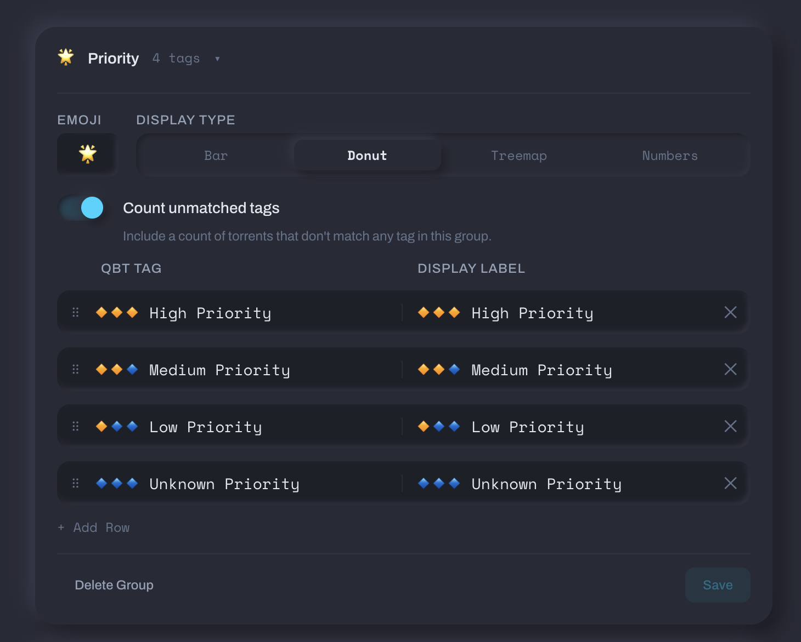
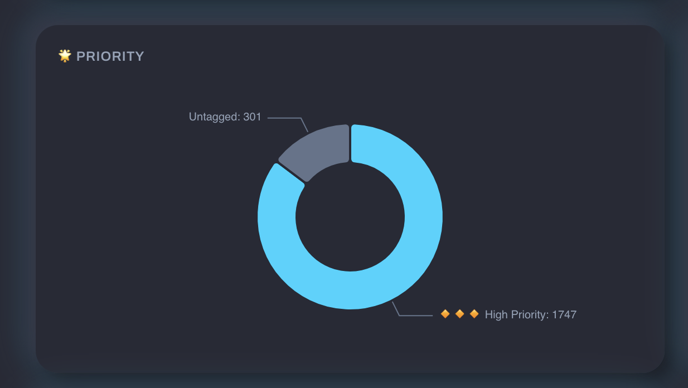
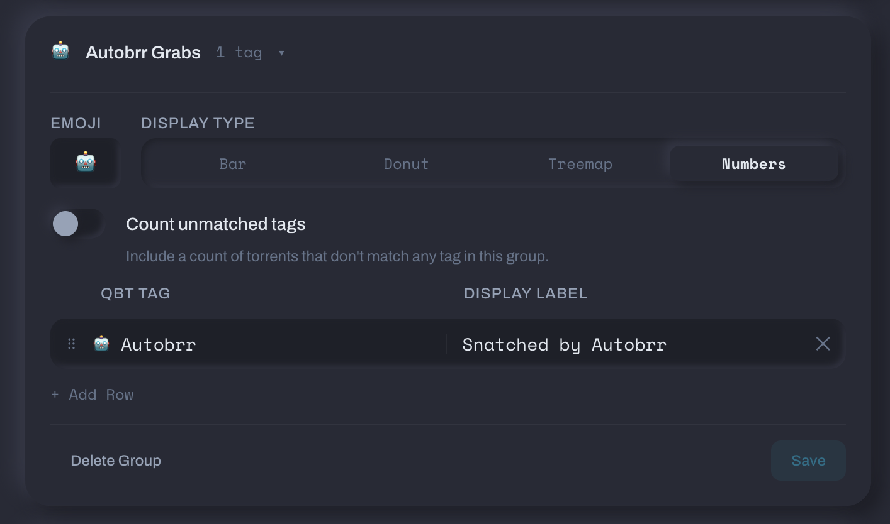
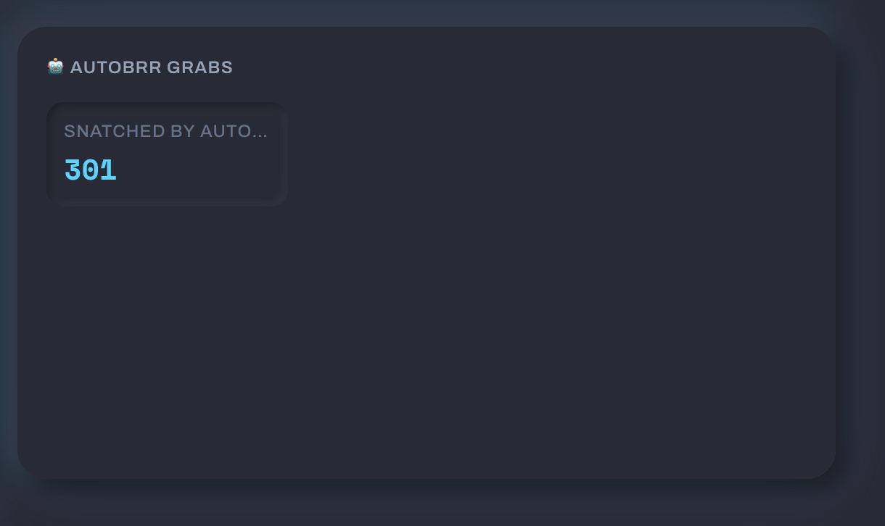
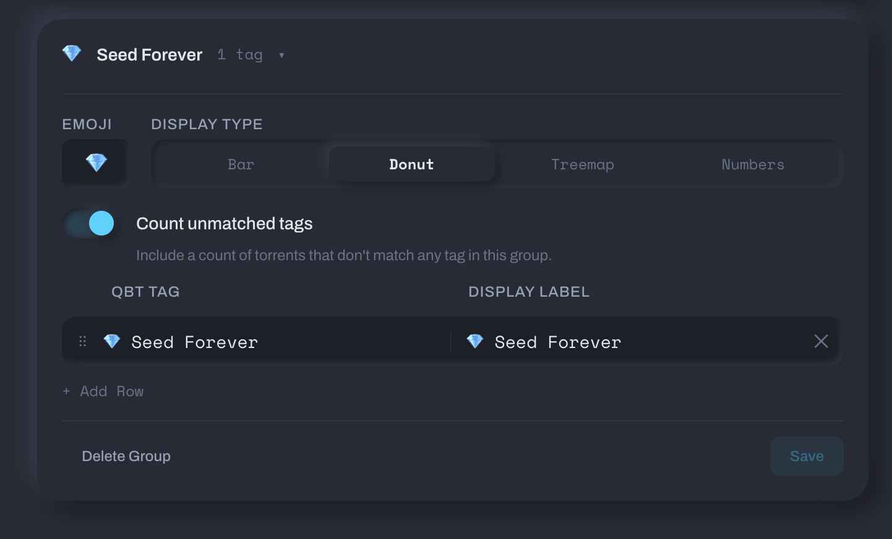
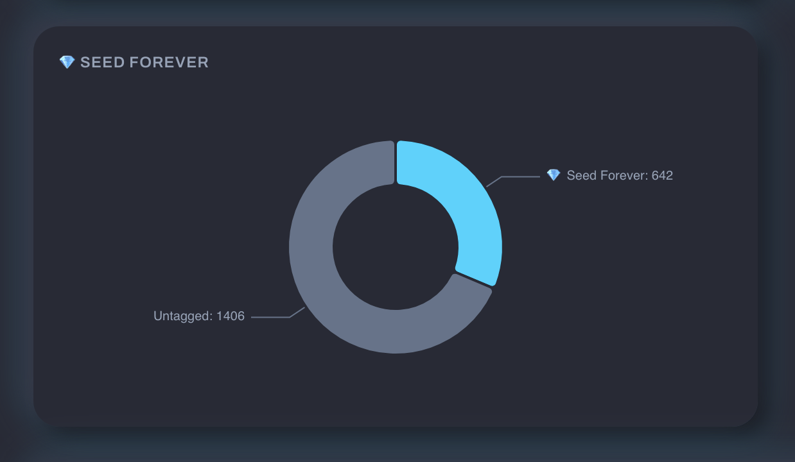

# Tag Groups

If you tag your torrents in qBittorrent, tag groups let you visualize those tags as charts on each tracker's Torrents tab. You define the groups once, and they show up on every tracker.

## What They're For

A few examples:

**Priority breakdown** — Group your `High Priority`, `Medium Priority`, `Low Priority`, and `Unknown Priority` tags into a single group. See the split as a donut chart.

This is what the Priority group looks like on a tracker's Torrents tab:

**Automation tracking** — Create an "Autobrr Grabs" group with your `Autobrr` tag to see how many torrents were auto-snatched. The numbers display type works well for single-tag groups.

**Long-term seeds** — A "Seed Forever" group with one tag to track how many torrents you've committed to permanent seeding.

## Creating a Tag Group

1. Go to **Settings → Download Clients** (scroll past your client cards).
2. Click **Add Tag Group**.
3. Name it and pick an emoji.
4. Add rows — each row maps a **qBittorrent tag** (the exact tag string as it appears in qBit) to a **display label** (what shows up in the chart).
5. Save.

The group immediately appears on the Torrents tab of every tracker that has matching torrents. Trackers with no matching torrents skip the chart silently.

## Display Types

Each group can use a different chart style:

| Type    | Best for                          |
| ------- | --------------------------------- |
| Bar     | Comparing counts across many tags |
| Donut   | Showing proportions of a whole    |
| Treemap | Dense view with lots of tags      |
| Numbers | Simple counts, no chart           |

## Count Unmatched Tags

When enabled, the chart includes an extra segment for torrents that don't match _any_ tag in the group. Useful for seeing how many torrents aren't categorized yet.

## Tag Matching

Tags must match **exactly** — same capitalization, same spacing, same characters. If your qBittorrent tag is `High Priority` and you type `high priority` in the group, it won't match.

!!! tip "Check your qBittorrent tags"
    Open qBittorrent and look at the tag list in the sidebar to see the exact tag names. Copy them character-for-character into Tracker Tracker.

## Automating with qbitmanage

If you use [qbitmanage](https://github.com/StuffAnThings/qbit_manage) to automate tagging in qBittorrent, tag groups light up automatically — qbitmanage writes the tags, Tracker Tracker reads them. See the [qbitmanage Integration](qbitmanage.md) page for setup examples including priority breakdowns, seed-forever tracking, and share limit health monitoring.

## Editing and Reordering

- **Rename a group** — double-click the group name.
- **Reorder tags** — drag the handle on the left side of each row.
- **Remove a tag** — click the X on the right.
- **Delete a group** — click Delete Group at the bottom (requires confirmation).

## Good to Know

- Tag groups are global — they apply to all trackers, not just one. If a group's tags don't match any torrents on a particular tracker, the chart simply doesn't appear there.
- Changes in settings take effect on the next page load of a tracker detail page.
- Tag groups are included in backups and restored automatically.
