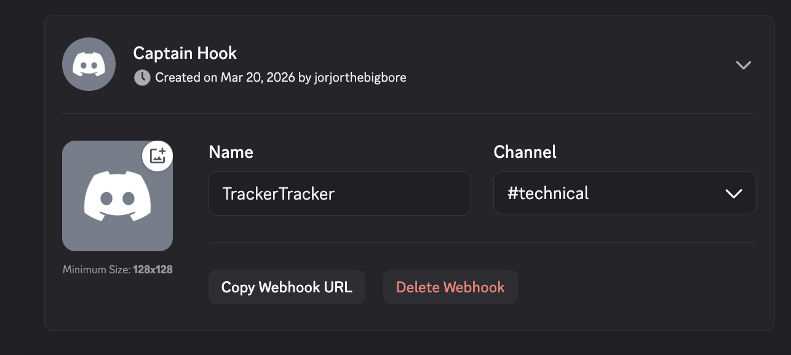
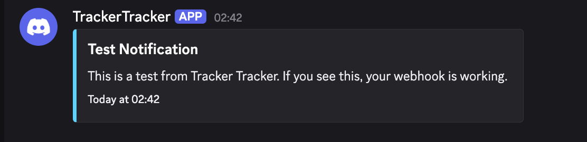

# Webhooks

Tracker Tracker can send you alerts when things happen on your trackers — ratio drops, hit-and-runs, outages, rank changes, and more.

## Supported Platforms

| Platform | Status    |
| -------- | --------- |
| Discord  | Supported |
| Slack    | Planned   |
| Telegram | Planned   |
| Gotify   | Planned   |
| ntfy     | Planned   |

## Setting Up Discord

### In Discord

1. Open the channel where you want alerts.
2. **Edit Channel → Integrations → Webhooks → New Webhook.**
3. Name it whatever you want (e.g., "Tracker Alerts").
4. Copy the webhook URL.

Keep this URL private — anyone with it can post to your channel.

### In Tracker Tracker

1. Go to **Settings → Notifications**.
2. Click **Add Notification Target**.
3. Select **Discord**, paste the URL, and give the target a name.
4. Choose which events you want.
5. Save, then click **Test Webhook** to confirm it works.

## Events

Each target subscribes to any combination of these events:

| Event            | Fires when                                       | Cooldown |
| ---------------- | ------------------------------------------------ | -------- |
| Ratio drop       | Ratio falls by ≥ 0.1 in one poll                 | 6 hours  |
| Hit-and-run      | H&R count goes up                                | 6 hours  |
| Tracker down     | A poll fails                                     | 6 hours  |
| Buffer milestone | Buffer crosses a threshold (default 10 GiB)      | 6 hours  |
| Account warned   | Account goes from not-warned to warned           | 6 hours  |
| Ratio danger     | Ratio drops below the tracker's required minimum | 24 hours |
| Zero seeding     | Tracker reports 0 active seeds                   | 24 hours |
| Rank change      | Your user class changes                          | 7 days   |
| Anniversary      | Membership hits 1 month, 6 months, then yearly   | 7 days   |

Cooldowns prevent spam — if a condition persists across multiple polls, you get one alert per cooldown period, not one per poll.

!!! info "First-poll behavior"
Events that compare snapshots (ratio drop, hit-and-run) need at least two polls and won't fire on the first one. Events like "account warned" fire immediately if the condition is already true.

## Thresholds

Two thresholds can be adjusted per target:

| Threshold        | Default | What it controls                                             |
| ---------------- | ------- | ------------------------------------------------------------ |
| Ratio drop delta | 0.1     | How much the ratio must fall in one poll to trigger an alert |
| Buffer milestone | 10 GiB  | The buffer size that triggers a milestone alert when crossed |

## Scoping to Specific Trackers

By default, a target gets events from all your trackers. You can restrict it to specific ones — events from other trackers are ignored.

Useful for separate channels per tracker, or if you only care about alerts for certain sites.

## Multiple Targets

You can set up more than one target. Some ideas:

- **One channel per tracker** — scope each target to a single tracker.
- **Urgent vs. routine** — ratio danger and tracker down in one channel, rank changes and anniversaries in another.
- **Private vs. shared** — turn off "Include tracker name" on targets that post to channels other people can see.

## Privacy

The **Include tracker name** toggle controls whether the tracker's name appears in messages. Turn it off if you share the channel.

If **Store usernames** is disabled in app settings, usernames are masked in notifications too.

Webhook URLs are encrypted in the database and never appear in API responses or logs.

## What the Messages Look Like

Notifications arrive as Discord embeds with a colored sidebar:

- **Red** — urgent: tracker down, hit-and-run, ratio below minimum, account warning
- **Amber** — caution: ratio drop, zero active seeds
- **Cyan** — positive: rank change, anniversary
- **Green** — milestone: buffer threshold crossed

## Troubleshooting

### Webhook shows "Failed"

Open the target card — the error under the status badge describes the problem. Common causes:

- **Webhook deleted in Discord.** Re-create it and update the URL in Tracker Tracker.
- **Channel deleted.** Discord removes all webhooks when a channel is deleted.
- **Network issue.** Transient problem. Click **Test Webhook** to retry.

### Notifications stopped arriving

After 3 consecutive failures, delivery pauses briefly and resumes automatically. If Discord was temporarily unreachable, notifications catch up on the next poll.

### Getting rate-limited

Discord allows roughly 30 webhook messages per minute per channel. To reduce volume:

- Increase your poll interval in **Settings → General**.
- Disable events you don't need.
- Spread targets across multiple Discord channels.

### Test works but real notifications don't

The test button sends a sample message. Real notifications need:

1. An event to actually occur (your ratio has to drop, not just be low).
2. The cooldown window to have elapsed since the last alert of that type.
3. At least two polls for comparison-based events (ratio drop, hit-and-run).
