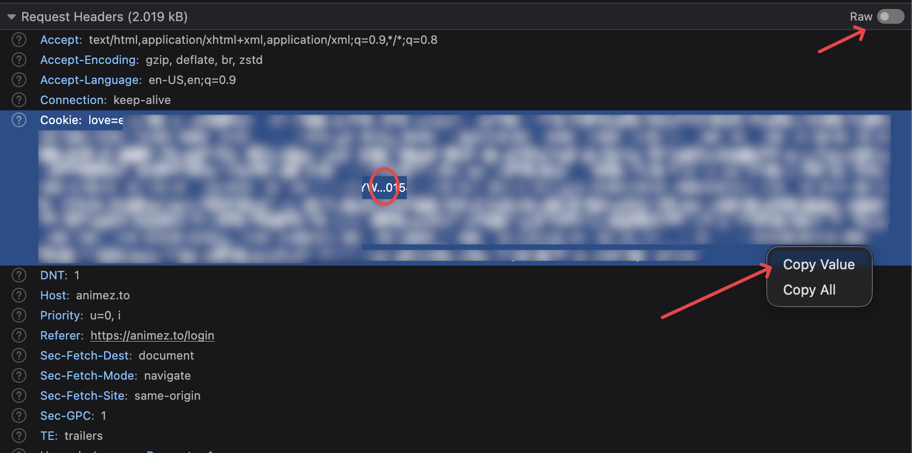
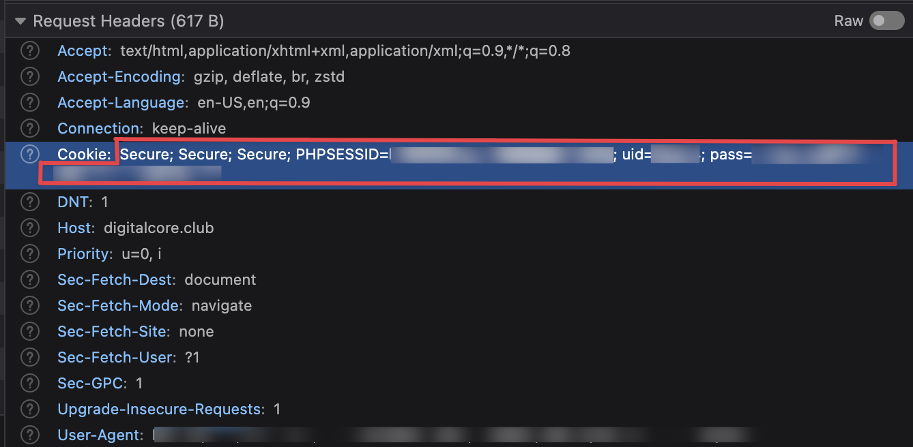

# Adding a Tracker

Tracker Tracker works with 40+ trackers. Pick one from the list below.

## Open the Add Tracker dialog

Click the **+** button next to "Trackers" in the sidebar, or go to `/trackers/new`.

## Tracker registry

=== "UNIT3D"

    | Name | Abbreviation |
    |---|---|
    | Aither | ATH |
    | Blutopia | BLU |
    | Concertos | |
    | FearNoPeer | FNP |
    | LST | LST |
    | OldToons | |
    | OnlyEncodes | OE |
    | Racing4Everyone | R4E |
    | ReelFlix | |
    | SkipTheCommercials | STC |
    | Seedpool | SP |
    | Upload.cx | |
    | DarkPeers | DP |
    | Luminarr | LUME |

=== "Gazelle"

    | Name | Abbreviation |
    |---|---|
    | AlphaRatio | AR |
    | AnimeBytes | AB |
    | BroadcasTheNet | BTN |
    | Empornium | EMP |
    | GreatPosterWall | GPW |
    | MoreThanTV | MTV |
    | Orpheus | OPS |
    | PassThePopcorn | PTP |
    | PhoenixProject | PPT |
    | REDacted | RED |

=== "GGn"

    | Name | Abbreviation |
    |---|---|
    | GazelleGames | GGn |

=== "Nebulance"

    | Name | Abbreviation |
    |---|---|
    | Anthelion | ANT |
    | Nebulance | NBL |

=== "AvistaZ"

    | Name | Abbreviation |
    |---|---|
    | AvistaZ | AvZ |
    | AnimeZ | AnZ |
    | CinemaZ | CZ |
    | ExoticaZ | ExZ |
    | PrivateHD | PHD |

=== "DigitalCore"

    | Name | Abbreviation |
    |---|---|
    | DigitalCore | DC |

!!! note "Draft entries"
    Some trackers show a dashed border saying "Stats tracking not yet supported." You can pin them as quicklinks, but they won't poll yet.

Added trackers hide from the list automatically.

## Required fields

### Base URL

The tracker's full HTTPS address.

### API token

Location varies by platform:

=== "UNIT3D"

    Go to **Settings → Security → API Token** or **Settings → API** in your account.

    Copy the entire alphanumeric string.

    !!! tip "Token rotation"
        Some UNIT3D trackers regenerate your token when you change your password. If polls stop working after a password change, grab a fresh token.

=== "Gazelle"

    - **RED / OPS** — **Settings → Access Settings → API Keys**. Create a new key (read-only is fine).
    - **BTN / PTP / AB / others** — Check **Settings → Security**, **Settings → API**, or your profile.

    Gazelle shows keys only once when created, so copy it right away.

    !!! tip "Scoped keys"
        Some Gazelle forks support limited-permission keys. Since Tracker Tracker only reads your stats, read-only access works great.

=== "GGn"

    Go to **Settings → Access Settings → API Key** and copy it.

    GGn keys don't expire automatically, but you can regenerate them anytime from your settings.

=== "AvistaZ"

    AvistaZ uses browser cookies instead of API keys.

    1. Open the tracker in your browser and log in
    2. Open DevTools (F12 or Cmd+Option+I)
    3. Go to the **Network** tab
    4. Refresh the page
    5. Click any request to the tracker's domain
    6. Find the `Cookie` header in **Request Headers**
    7. **Right-click** the Cookie header and select **Copy Value**

    

    You'll also need your **username** on that tracker.

    Paste both into the Add Tracker dialog. The User-Agent gets captured automatically.

    !!! danger "Do not select and copy the Cookie value directly"
        Firefox (and some Chromium browsers) truncate long header values in the display, replacing the end with `…`. If you select the text and copy it, you'll get the truncated version with the ellipsis character embedded. This causes a "Tracker test failed" error.

        Always use **right-click → Copy Value** to get the full, untruncated cookie string.

    !!! warning "Cookie expiration"
        The Cloudflare `cf_clearance` cookie expires periodically. When polling fails, refresh it by repeating the steps above.

    !!! warning "Newbie rank not supported"
        AvistaZ restricts Newbie accounts to limited site access. You need **Member** rank (5 GB upload, ratio ≥ 1.0, 7+ days old) before the profile page shows the data Tracker Tracker needs. Wait until promotion before adding the tracker.

=== "DigitalCore"

    DigitalCore uses session cookies instead of API keys.

    1. Open [digitalcore.club](https://digitalcore.club) in your browser and log in
    2. Open DevTools (F12 or Cmd+Option+I)
    3. Go to the **Network** tab
    4. Refresh the page
    5. Click any request to `digitalcore.club`
    6. Find the `Cookie` header in **Request Headers** and copy its full value

    The string will contain `uid=...` and `pass=...` among other values. Paste the entire thing into the Add Tracker dialog. Tracker Tracker extracts what it needs automatically.

    

    !!! tip "Alternative: Application tab method"
        Go to **Application** → **Cookies** → `digitalcore.club` and copy the `uid` and `pass` values. Paste them as `uid=12345; pass=abc123...`.

    !!! warning "Cookie expiration"
        Session cookies expire when you log out or after extended inactivity. If polling fails with "Session expired," log back into DigitalCore and re-copy the cookie values.

    !!! info "DigitalCore's API key won't work"
        DigitalCore has an API key feature, but it only allows access to torrent search endpoints. User stats require session cookies, which is why Tracker Tracker uses the cookie approach.

!!! warning "Keep your token private"
    Your API token works like a password. Tracker Tracker encrypts it before storing it.

## Optional fields

### Proxy

If the tracker needs a proxy (i.e., for geo-restrictions), toggle **Use Proxy** on the tracker's settings page. See [Proxy Support](../features/proxies.md) for setup.

!!! tip "Getting a red dot?"
    Check your API token — most often it's a copy-paste error or a token that rotated after you saved it.

## Poll manually

The **Poll Now** button on any tracker's detail page fetches stats immediately. Use it after updating a token or testing connectivity.

Manual polls don't interfere with the global schedule (default: every 60 minutes).

---

## What stats each platform provides

Different platforms expose different stats. Here's what you'll get:

| Stat             | UNIT3D | Gazelle | GGn     | AvistaZ | DigitalCore | Notes                                                                        |
| ---------------- | ------ | ------- | ------- | ------- | ----------- | ---------------------------------------------------------------------------- |
| Upload           | Yes    | Yes     | Yes     | Yes     | Yes         |                                                                              |
| Download         | Yes    | Yes     | Yes     | Yes     | Yes         |                                                                              |
| Ratio            | Yes    | Yes     | Yes     | Yes     | Yes         | GGn shows extra decimal precision                                            |
| Buffer           | Yes    | Yes     | Yes     | Yes     | Yes         | UNIT3D returns this directly; others calculate it from upload minus download |
| Seeding count    | Yes    | Partial | Partial | Yes     | Yes         | Some Gazelle forks and GGn may return 0 even when you're seeding             |
| Leeching count   | Yes    | Partial | Partial | Yes     | Yes         | Same as above                                                                |
| Bonus points     | Yes    | Yes     | Yes     | Yes     | Yes         | GGn calls this "gold," DigitalCore calls it "bonuspoang"                     |
| Hit & Runs       | Yes    | No      | Partial | Yes     | Yes         | GGn shows unknown for Elite Gamer+ (HNR immunity)                            |
| Required ratio   | No     | Yes     | Yes     | No      | No          | Not in the UNIT3D or DigitalCore API                                         |
| Warned status    | No     | Partial | Yes     | No      | Yes         | Most Gazelle trackers default to false; RED has extended data                |
| Freeleech tokens | No     | Partial | No      | No      | No          | Not all Gazelle forks expose this                                            |

### Gazelle: extra data on RED

REDacted and Phoenix Project return additional fields — warned status, join date, avatar, and detailed seeding/leeching counts — giving you richer info than other Gazelle trackers.

### GGn quirks

- **Seeding/leeching can show 0** — GGn's API doesn't always expose these counts. That's normal.
- **Hit & Runs shows unknown** for Elite Gamer and above — those classes are HNR-immune.
- **Gold, not seedbonus** — GGn calls bonus currency "gold," which we map to the bonus points field.

---

## Troubleshooting

### Token not working

Make sure you copied the full token. UNIT3D tokens are usually 60-80 characters. Gazelle shows keys only once when you create them.

### Poll fails with 401

Your token expired or was regenerated. Get a fresh token from the tracker's settings and update it.

### Bonus points show unavailable

Some heavily customized Gazelle forks don't include bonus points in their API. The tracker just doesn't expose it.

### Seeding count always shows 0

Some Gazelle forks and GGn don't expose seeding counts via their API. If you're seeding but see 0, it's a platform limitation.

### Warned status always shows false

That's expected for most Gazelle trackers. Only RED and Phoenix Project provide this.
