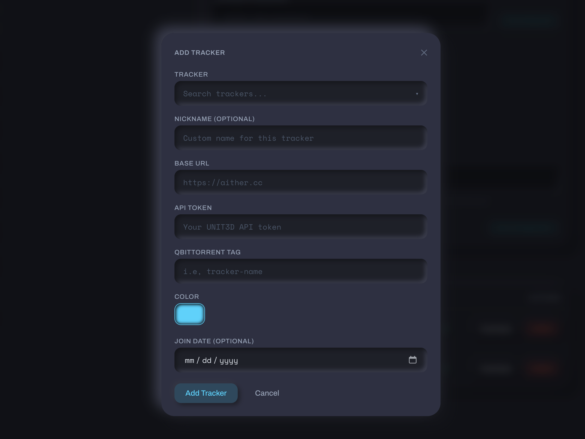
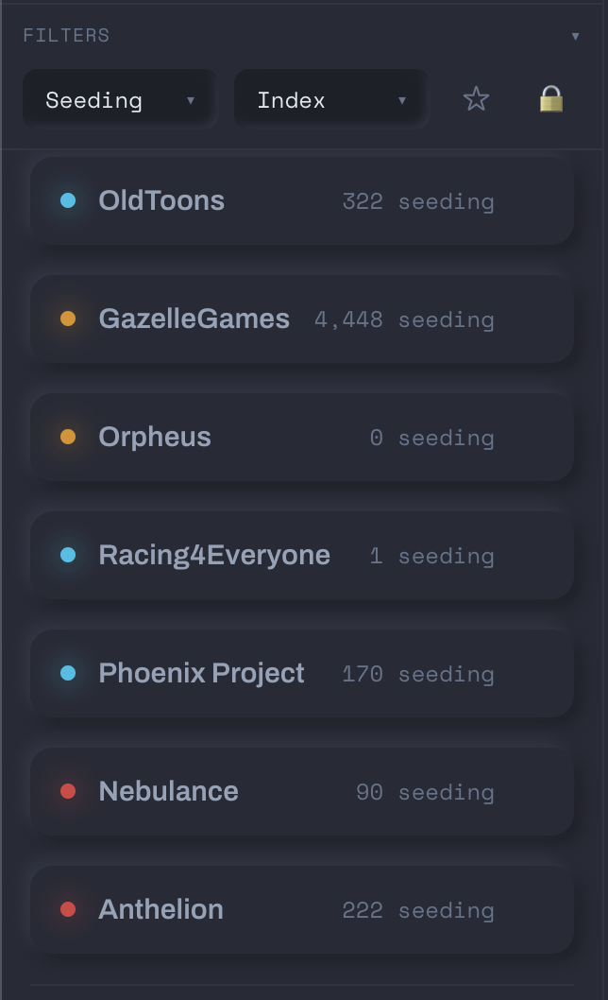

# Adding a Tracker

Tracker Tracker supports 40+ trackers across four platforms: UNIT3D, Gazelle, GGn, and Nebulance. Most are in the built-in registry — pick one from the list and the URL and platform fill in automatically.

## Opening the Add Tracker dialog

Click the **+** button next to "Trackers" in the sidebar, or go to `/trackers/new`.

## The tracker registry

=== "UNIT3D"

    | Name | Abbreviation |
    |---|---|
    | Aither | ATH |
    | Blutopia | BLU |
    | Concertos | |
    | FearNoPeer | FNP |
    | LST | LST |
    | OldToons | |
    | OnlyEncodes | OE |
    | Racing4Everyone | R4E |
    | ReelFlix | |
    | SkipTheCommercials | STC |
    | Seedpool | SP |
    | Upload.cx | |

=== "Gazelle"

    | Name | Abbreviation |
    |---|---|
    | AlphaRatio | AR |
    | AnimeBytes | AB |
    | BroadcasTheNet | BTN |
    | Empornium | EMP |
    | GreatPosterWall | GPW |
    | MoreThanTV | MTV |
    | Orpheus | OPS |
    | PassThePopcorn | PTP |
    | PhoenixProject | PPT |
    | REDacted | RED |

=== "GGn"

    | Name | Abbreviation |
    |---|---|
    | GazelleGames | GGn |

=== "Nebulance"

    | Name | Abbreviation |
    |---|---|
    | Anthelion | ANT |
    | Nebulance | NBL |

=== "AvistaZ"

    | Name | Abbreviation |
    |---|---|
    | AvistaZ | AvZ |
    | AnimeZ | AnZ |
    | CinemaZ | CZ |
    | ExoticaZ | ExZ |
    | PrivateHD | PHD |

!!! note "Draft entries"
    Some trackers in the registry are marked as drafts — dashed border, "Stats tracking not yet supported." You can pin them as quicklinks but no stats will be polled.

Trackers you've already added are hidden from the list automatically.

## Required fields

### Base URL

The full HTTPS address for the tracker.

### API token

Where to find it depends on the platform:

=== "UNIT3D"

    Go to your account settings. Look for `Settings → Security → API Token` or `Settings → API`.

    The token is a long alphanumeric string — copy the whole thing.

    !!! tip "Token rotation"
        Some UNIT3D trackers regenerate your token when you change your password. If polls stop working after a password change, grab a fresh token.

=== "Gazelle"

    - **RED / OPS** — `Settings → Access Settings → API Keys`. Create a new key. Read-only is sufficient.
    - **BTN / PTP / AB / others** — check `Settings → Security`, `Settings → API`, or your profile page.

    Gazelle keys are usually shown only once when created. Copy it immediately.

    !!! tip "Scoped keys"
        Some Gazelle forks let you create keys with limited permissions. Tracker Tracker only reads your stats — read-only works fine.

=== "GGn"

    Go to `Settings → Access Settings → API Key`. Copy the full key.

    GGn keys don't expire on their own, but they can be regenerated from your settings.

=== "AvistaZ"

    AvistaZ network trackers use browser cookies instead of API keys.

    1. Open the tracker site in your browser and make sure you're logged in
    2. Open DevTools (F12 or Cmd+Option+I)
    3. Go to the **Network** tab
    4. Refresh the page
    5. Click any request to the tracker's domain
    6. In the **Request Headers**, find the `Cookie` header and copy its full value

    You'll also need your **username** on the tracker.

    Paste both into the Add Tracker dialog — the User-Agent is captured automatically.

    !!! warning "Cookie expiration"
        The Cloudflare `cf_clearance` cookie expires periodically. When polls start failing, refresh the cookie by repeating the steps above.

    !!! warning "Newbie rank cannot use this feature"
        AvistaZ network sites restrict Newbie accounts to limited site access. You must reach **Member** rank (5 GB upload, ratio >= 1.0, account age >= 7 days) before the profile page exposes the data Tracker Tracker needs. If you are still a Newbie, wait until you are promoted before adding the tracker.

!!! warning "Keep your token private"
    Your API token acts like a password for your account. Tracker Tracker encrypts it before storing it.

## Optional fields

### Proxy

If the tracker needs a proxy (e.g., for geo-restrictions), toggle **Use Proxy** on the tracker's settings page. See [Proxy Support](../features/proxies.md) for setup.

## What happens after you save

1. The tracker is saved and an immediate poll runs.
2. The **PulseDot** on the tracker card shows the result:
   - Breathing cyan — poll succeeded
   - Amber — warning or partial data
   - Red — poll failed (bad token, network error, etc.)
3. The tracker appears in the dashboard and sidebar.

!!! tip "Red dot right after adding?"
    Check your API token. The most common cause is a copy-paste error or a token that was rotated after you copied it.

## Polling manually

The **Poll Now** button on any tracker's detail page runs an immediate fetch outside the normal schedule. Use it after updating a token or testing connectivity.

The global schedule (default: every 60 minutes) runs all trackers on a shared timer. Manual polls don't change it.

---

## What's tracked per platform

Not every platform exposes the same stats. Here's what you'll see:

| Stat             | UNIT3D | Gazelle | GGn     | AvistaZ | Notes                                                                        |
| ---------------- | ------ | ------- | ------- | ------- | ---------------------------------------------------------------------------- |
| Upload           | Yes    | Yes     | Yes     | Yes     |                                                                              |
| Download         | Yes    | Yes     | Yes     | Yes     |                                                                              |
| Ratio            | Yes    | Yes     | Yes     | Yes     | GGn shows extra decimal precision                                            |
| Buffer           | Yes    | Yes     | Yes     | Yes     | UNIT3D returns this directly; others calculate it from upload minus download |
| Seeding count    | Yes    | Partial | Partial | Yes     | Some Gazelle forks and GGn may return 0 even when you're seeding             |
| Leeching count   | Yes    | Partial | Partial | Yes     | Same as above                                                                |
| Bonus points     | Yes    | Yes     | Yes     | Yes     | GGn calls this "gold" — it maps automatically                                |
| Hit & Runs       | Yes    | No      | Partial | Yes     | GGn shows unknown for Elite Gamer+ (HNR immunity)                            |
| Required ratio   | No     | Yes     | Yes     | No      | Not in the UNIT3D API                                                        |
| Warned status    | No     | Partial | Yes     | No      | Most Gazelle trackers default to false; RED has extended data                |
| Freeleech tokens | No     | Partial | No      | No      | Not all Gazelle forks expose this                                            |

### Gazelle: enriched data on RED

REDacted (and Phoenix Project) fetch additional data beyond the standard stats — including warned status, join date, avatar, and more detailed seeding/leeching counts. If you're on RED, you'll see richer data than on other Gazelle trackers.

### GGn quirks

- **Seeding/leeching can show 0** — GGn's API doesn't always return these counts. Not a polling error.
- **Hit & Runs shows unknown** for Elite Gamer and above — those classes are HNR-immune, so GGn returns null.
- **Gold, not seedbonus** — GGn's bonus currency is called "gold." Tracker Tracker maps it to the same field as bonus points on other trackers.

---

## Common issues

### Token not working

Make sure you copied the full token. UNIT3D tokens are typically 60-80 characters. Gazelle keys are shown only once when created.

### Poll fails with 401

Your token has expired or been regenerated. Copy the current token from the tracker's settings and update it in Tracker Tracker.

### Bonus points show as unavailable

A small number of heavily customized Gazelle forks don't include bonus points in their API. Nothing to configure — the tracker doesn't expose it.

### Seeding count is always 0

Some Gazelle forks and GGn don't include seeding counts in their standard API response. If you're actively seeding and see 0, it's a platform limitation.

### Warned status is always false

Expected for most Gazelle trackers. Only RED and Phoenix Project provide this data.
